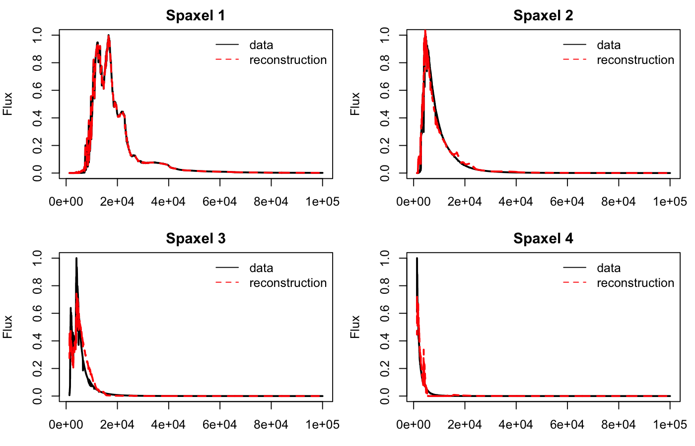

```{r}
library(SpectralUnmix)
demo <- coelho_demo_spectra()
```

## Load the bundled spectra

The bundled Coelho demo provides four normalized stellar spectra on a common
wavelength grid. It is the simplest fully reproducible entry point for the
package.

```{r}
dim(demo$matrix)
demo$metadata
```

## Fit the model

```{r, eval = FALSE}
fit <- spectral_unmix(
  demo$matrix,
  k = 4,
  lambda_smooth = 0,
  niter = 400,
  lr = 0.03
)
```

## Inspect the result

```{r, eval = FALSE}
print(fit)
summary(fit)
basis(fit)
coef(fit)
fit$niter_run
fit$converged
```

## Plot the spectra

```{r, eval = FALSE}
plot(fit, type = "spectra", wavelength = demo$wavelength)
plot_reconstruction(
  fit,
  demo$matrix,
  wavelength = demo$wavelength
)
```

Recovered-versus-observed view for the bundled Coelho sample:



## What the outputs mean

- `fit$spectra` contains the recovered component spectra.
- `basis(fit)` returns those components as wavelength-by-component columns.
- `fit$reconstruction` is the model approximation `A %*% S`.
- `fit$loss` stores the optimization history.
- `fit$niter_run` reports how many optimization steps were actually used.
- `fit$converged` reports whether early stopping triggered before `niter`.

## Larger library subset

For a denser stellar-library example, use the curated Coelho subset bundled
with the package.

```{r}
stellar_lib <- coelho_stellar_subset()
dim(stellar_lib$matrix)
table(stellar_lib$metadata$type)
```

```{r, eval = FALSE}
fit_lib <- spectral_unmix(
  stellar_lib$matrix,
  k = 5,
  lambda_smooth = 0.001,
  niter = 500,
  lr = 0.03
)

plot(fit_lib, type = "spectra", wavelength = stellar_lib$wavelength)
```

## IFU note

The package still supports cube workflows through `cube_to_matrix()`,
`matrix_to_cube()`, `predict(type = "cube")`, and `component_map()`. Those
helpers are kept in the API, but the website examples stay focused on the
bundled Coelho data so the documentation remains short and reproducible.
