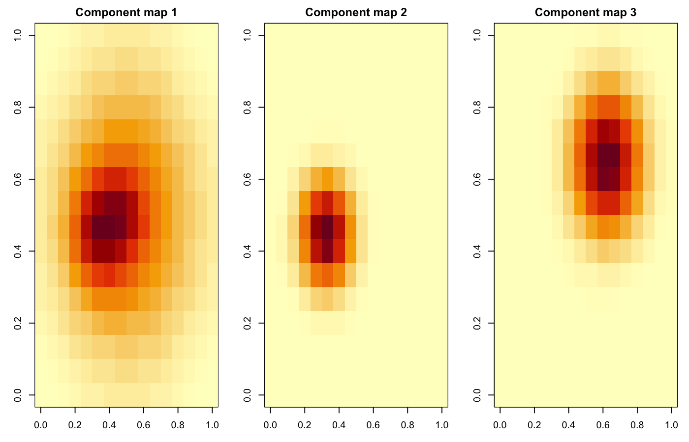

## FITS to matrix

```{r, eval = FALSE}
library(FITSio)
library(SpectralUnmix)

X <- readFITS("cube.fits")
Mat <- cube_to_matrix(X)
Mat[!is.finite(Mat)] <- 0
Mat <- pmax(Mat, 0)
```

## Fit and inspect

```{r, eval = FALSE}
fit <- spectral_unmix(Mat, k = 5, lr = 0.01, niter = 5000)

plot(fit, type = "spectra")
plot(fit, type = "maps", nx = dim(X$imDat)[1], ny = dim(X$imDat)[2])
plot_reconstruction(fit, Mat, n = 6)
```

Example spatial maps from the bundled synthetic cube:



## Reconstruction outputs

```{r, eval = FALSE}
maps <- predict(fit, type = "spatial")
cube_hat <- predict(
  fit,
  type = "cube",
  nx = dim(X$imDat)[1],
  ny = dim(X$imDat)[2]
)
resid <- residuals(
  fit,
  x = Mat,
  nx = dim(X$imDat)[1],
  ny = dim(X$imDat)[2]
)
```

## Metadata and redshift

When the input to `cube_to_matrix()` is a FITS-like list object, non-image
entries are carried forward as metadata. That metadata can be recovered from
the fitted object or reconstructed cube with `cube_metadata()`.

```{r, eval = FALSE}
fit <- spectral_unmix(Mat, k = 5, lr = 0.01, niter = 5000)
cube_metadata(fit)
cube_metadata(cube_hat)
```

If redshift information is stored in the FITS-side metadata, it will now be
preserved as metadata and can be carried into fitted and reconstructed outputs.
