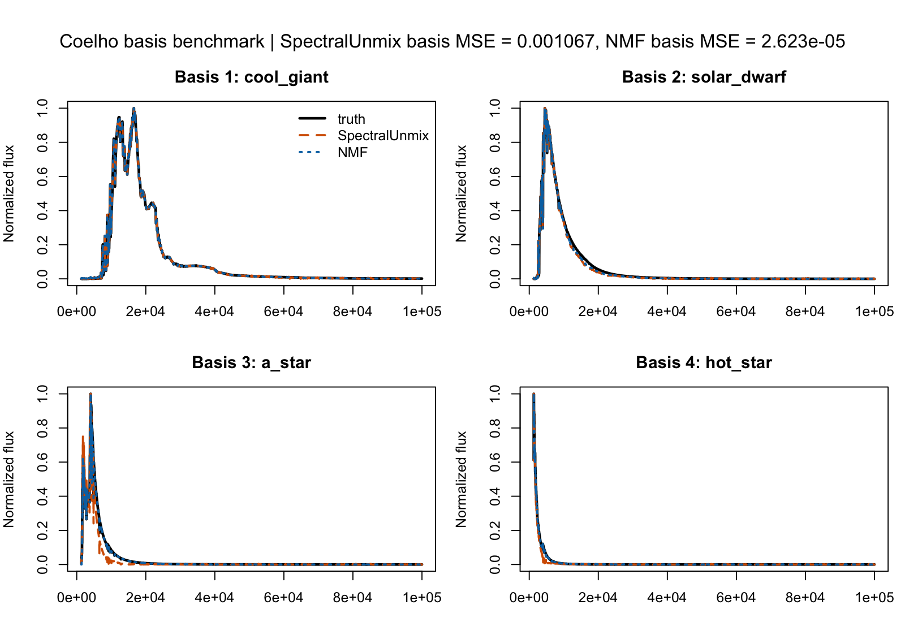

`SpectralUnmix` is an R package for smooth non-negative spectral unmixing of
hyperspectral datasets and astronomical IFU cubes.

## Model

The package solves

$$ X \approx A S$$

where `X` is a spaxel-by-wavelength matrix, `A` contains spatial abundances,
and `S` contains component spectra.

Each input spectrum is modeled as a non-negative combination of a small number
of latent spectral components. 
## Output example

The figure below shows the Coelho-based benchmark used in the validation page.
The comparison is made on a controlled mixture benchmark built from the bundled
stellar spectra.



## Reproducible example

```r
library(SpectralUnmix)

demo <- coelho_demo_spectra()

fit <- spectral_unmix(
  demo$matrix,
  k = 4,
  lambda_smooth = 0,
  niter = 400,
  lr = 0.03
)

plot(fit, type = "spectra", wavelength = demo$wavelength)
plot_reconstruction(fit, demo$matrix, wavelength = demo$wavelength)
```

## Main functions

- `spectral_unmix()` fits the model.
- `basis()` and `coef()` provide NMF-style accessors.
- `fitted()`, `predict()`, and `residuals()` provide standard model methods.
- `plot()` and `plot_reconstruction()` provide quick diagnostics.
- `cube_to_matrix()` and `matrix_to_cube()` remain available for IFU workflows.


## Installation

```r
# install.packages("remotes")
remotes::install_github("RafaelSdeSouza/SpectralUnmix")
```

`torch` must be available in the local R installation.
